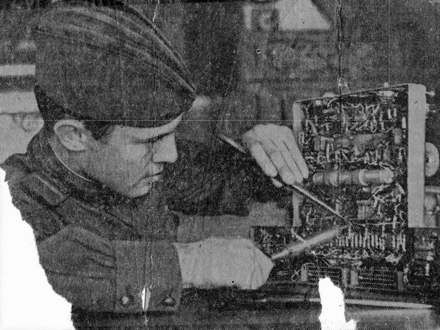

Periodic noise removing filter
==========================

Goal
----

In this tutorial you will learn:

-   how to remove periodic noise in the Fourier domain

Theory
------

Removes periodic noise, background and interferences in the Fourier domain. Useful for latent fingerprints, capture artifacts and electromagnetic interferences in videos

Result
------
Below you can see the real world image with periodic noise

Below you can see the restoration result.

